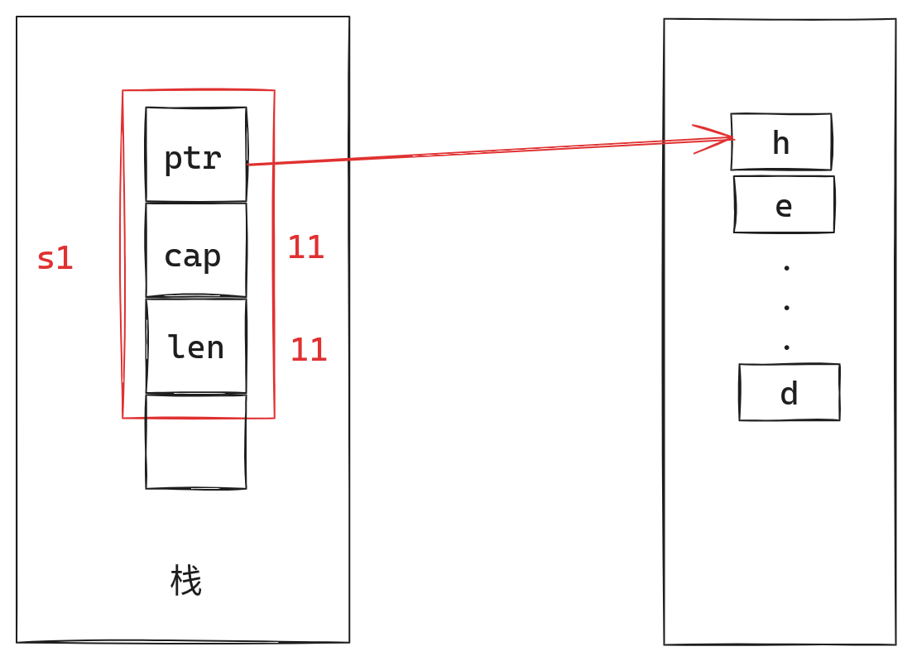

+++
title = "Rust所有权机制分析"
description = "本文将从内存管理出发，去审视Rust的所有权机制及借用规则"
date = 2024-06-21
[taxonomies]
categories = ["rust"]
tags = ["rust", "所有权", "借用规则"]

[extra]
comments = true
toc = true
+++

众所周知，Rust向来以内存安全自称，且无GC。这究竟是怎么做到的？我们来一起一探究竟吧。

<!-- more -->

# 内存管理的经典方式

## 常见的内存管理方式

1. 手动管理。
> 例如C语言，程序员需要显式地分配和释放内存。优点是高效且控制精细，高度灵活可自定义。但是程序员必须时刻记住内存何时需要回收，这会给程序员带来极大的心智负担。
2. 自动管理
> 通过GC实现。例如Java，Go等语言。优点是减少悬空指针，双重释放错误，内存泄漏的风险。而代价是在运行期的性能开销，甚至是偶发的不可接受的暂停时间（Stop The World）
3. 引用技术
> 例如Objective-C，Python等语言，每个对象都有一个引用计数，当引用计数变为零时，释放该对象的内存。优点是简单直接，缺点是处理循环引用困难。

## Rust的内存管理方式

Ok，介绍了一些常见编程语言的内存管理方式，并且简要的分析了其优缺点。接下来我们看一下Rust是如何实现内存管理的。
```rust
fn main() {
    let s1 = String::from("hello world");
    println!("{}", s1);
    let s2 = s1;
    println!("{}", s2);
    // println!("{}", str); // error[E0382]: use of moved value: `s1`
}
```

上述代码是rust用来展示所有权机制的一个经典代码，不过也可以用来展示其内存管理机制是如何运行的。

当变量s1创建之后，我们来看一下此时程序的堆栈情况:



变量s1是一个胖指针，包含（`ptr只想堆内存的指针`，`cap可用堆字节数`，`len已经使用的字节数`）用来管理其分配在堆上的内存`hello world`
`hello world`一共占用11个字节，在笔者的电脑上，此时cap和len均为11。

到此，rust看起来和其他语言没有任何区别。我们接着看`let s2 = s1`


这看起来也挺正常的，类似于发生了一次浅拷贝。但是在Rust中，这种行为被称之为移动，也就是我们常说的Move语义。他不仅仅按位拷贝了一份栈上的数据，还会令旧数据（指s1这个旁指针本身，而非堆中的`hello world`）立即失效[^1]，我们可以看到上述代码只有注释掉了第二次打印`s1`才能编译通过，否则报错`use of moved value`。

总结一下，Rust的所有权规则会在变量被移动时，将旧的变量标记失效，不允许你再次访问，同时按位拷贝旧变量。抽象一下说就是，Rust不允许`别名`[^2]的存在。

换句话说就是，在Safe Rust中，给你做出了一个保证，任何一个值，在任何时候都只会有一个所有者。

当所有者离开作用域时，值被丢弃。

# 所有权规则

> 1. Rust 中的每一个值都有一个被称为其 所有者（owner）的变量。
> 2. 值在任一时刻有且只有一个所有者。
> 3. 当所有者（变量）离开作用域，这个值将被丢弃。

上述规则摘抄自《The book》中文版。

只有从内存管理的角度理解透彻了之后，才能明白这三条规则都在反反复复的诉说同一件事————只有所有者才有权决定何时释放内存。

# Move 和 Copy 语义

Move语义是Rust默认的规则，当赋值，传参，返回值产生时默认是Move语义，转移所有权。当然也有例外即，任何实现了`Copy` trait的结构体，默认执行Copy语义。Move语义我们在上述分析中已经阐明。而Copy语义就是`按位拷贝`，也就是我们通常所说的浅拷贝。

下面我们来做一个对比：

| 语义 | 何时生效 | 是否允许访问原变量 |
|---------|---------|---------|
| Move | 对于任何类型，只要其没有实现Copy trait | 是 |
| Copy | 当切近当类型实现了Copy trait  | 否 |

到此我们应该有一个大致的判断，一个类型实现了Copy trait，一般就意味着他不存在堆数据，但是他有一个super tarit `Clone`。

## 为什么Clone是Copy的super trait

这个问题需要深入理解`Copy`和`Clone`存在意义才能解释清楚。

> Clone

```rust
pub trait Clone: Sized {
    fn clone(&self) -> Self;

    #[inline]
    fn clone_from(&mut self, source: &Self) {
        *self = source.clone()
    }
}
```

1. Clone是一种`深拷贝`的统一接口，提供了`fn clone(&self) -> Self`和`fn clone_from(&mut self, source: &Self)`两个接口，用户只需实现clone即可
2. clone的语义就是深拷贝，因此不仅需要处理栈中的数据，也需要处理堆中的数据，例如`Vec<T>`，`String`等等。
3. cloen的实现有程序员进行，由程序员保证堆中数据被处理妥善
4. 当且仅当程序员显示调用clone或者clone_from时才会生效

> Copy
```rust
/// Types whose values can be duplicated simply by copying bits.
pub trait Copy: Clone { }
```
1. Copy只是一个marker trait，且无需程序员实现，官方文档解释的也很清楚，按位拷贝。
2. Copy的内部实现有编译器决定，由编译器负责
3. 若想实现Copy，则类型的所有成员都要是Copy的
4. 当赋值，传参，返回值等情况发生时，自动调用

> 解释

看完了这两个trait都表示那些涵义其实答案很清楚了：
1. Copy代表着浅拷贝，而实现了Copy的类型，一定能够实现clone方法，如果你使用派生的方式为结构体实现Clone trait，则其实本是上Clone == Copy，除非你手动实现Clone，并自定义clone的逻辑。
2. 那么问题就来了，既然类型能够实现Copy，那我不现实Copy，只实现Clone可以么？当然可以，但是此时如果发生了赋值，传参，返回值等情况下，默认就是Move语义了

总之就是一句话，Copy之所以要将Clone设置为super trait，其实就是给程序员一个保证，任何实现了Copy的类型，都会有clone的实现（无论是程序员手动实现还是由编译器派生）

## 为什么实现了Drop就不能再实现Copy

```rust
pub trait Drop {
    fn drop(&mut self);
}
```

实现了Drop就意味着，类型需要释放资源，一般也意味着类型拥有堆中的数据。那么谁有权利决定何时释放内存呢？答案是，所有者。

此时如果类型还实现了Copy会发生什么呢？

当赋值，传参，返回值产生时，将不再执行Move语义，让原有变量失效，而是执行Copy语义，按位拷贝栈上的数据（往往包含指向堆区的指针）也就会造成多个所有者的局面。这不仅违反了Rust的单一所有者规则，也会导致`double free`的内存安全问题，因此Rust在设计之处就杜绝了同时实现Copy和Drop，或者说Move和Copy只能二选一。

# 借用规则

上面我们一直在将Rust的所有权规则，那么如果我们不想移动所有权有没有什么办法呢？

当然，那就是`借用`，同样在《The book》上也有对于借用的几条规则：

> 1. 在任意给定时间，要么 只能有一个可变引用，要么 只能有多个不可变引用
> 2. 引用必须总是有效的

在Rust中，引用就是借用，翻译为借用更突出`借`这个语义，本文不会纠结于翻译。而引用的本质就是指针，只不过rust赋予了他更强大的功能。

## 可变引用的排他性
上面的第一条规则，其实很好理解，其实就是和`读写锁`一模一样的，也很好解释，避免产生数据竞争。如果可变引用和不可变引用没有任何限制，则会导致内存安全问题。

> 举个例子，`Vec<i32>`

如果有不可变引用指向第一个元素。同时又允许可变引用对Vec进行修改，那么当扩容发生时，那么继续访问不可变引用所指向的内存地址将是非法的。因此Rust规定了，要么有一个可变引用，要多可以有多个不可变引用。

## 引用必须是有效的

```rust
fn dangle() -> &String {
    let s = String::from("hello");
    &s
}
```

引用无法改变所有者何时释放内存，因此当`引用的值的所有者`离开作用域时，这个引用也就随之失效。因为本质上何时释放内存仍由所有者说了算。

# Comments

[^1] 这里所说的立即失效，是说编译器不允许你后续再次使用s1这个变量，而不是指`s1`这个胖指针会立即从栈中被抹除。所以任何访问了已经被编译器标记为失效的变量的行为都是UB，这个问题我后续会在自引用结构同单独讲

[^2] 别名的存在，会让程序的静态分析变得复杂，我们需要跟踪每一个别名的生命周期才能最终确认这个变量何时才需要释放。